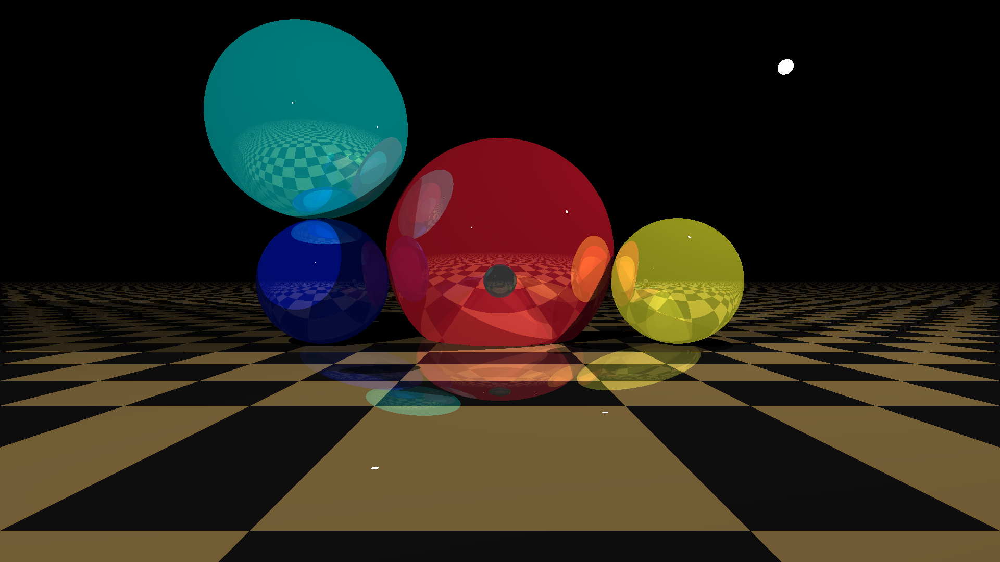

# Flags
Run with: `python main.py`

`-s` saves a screenshot when done with render (Beware that if you're moving around in the scene this will yield a lot of screenshots)

`-f` opens the program in fullscreen

`-width` width for viewport, default to 300

`-height` height for viewport, defaults to 200

`-scene` loads a scene-file to render

`-max` specify max depth for reflections, defaults to 3

`-hm` runs the program in headless mode, meaning no window will be created, should be used with the `-s` flag
Examples:

`python main.py -f -s -scene "scenes/scene01.scene"`

`python main.py -scene "scenes/scene01.scene" -width 100 -height 100`

`python main.py -scene "scenes/scene01.scene" -width 1200 -height 800 -s -hm`

# Primitive camera movement:
**Camera code was not done properly this time around.**

`WASD` to move the camera around

`Arrow keys` to look up and down (left and right is not working properly)

# Scene files
Check out the `scenes`-folder for an example on how to make a simple scene

# Result #1 (1920x1080, 9.8 minutes with 8 reflection rays as max depth)

# Result #2 (4K, 40 minutes with 10 reflection rays as max depth)
